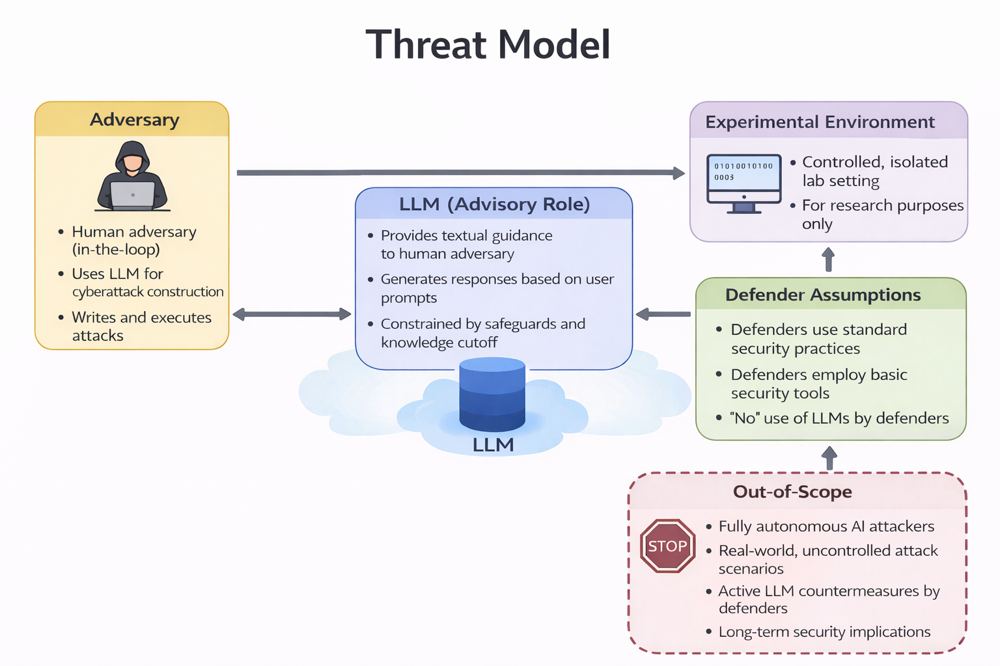

# Threat Model

This directory contains the threat model used to frame the evaluation of LLM-assisted cyberattack construction in the accompanying paper.

## Overview

The threat model adopts a human-in-the-loop adversarial setting in which a human attacker leverages a large language model (LLM) as an advisory system. The LLM provides textual guidance and procedural suggestions but does not execute code, interact directly with systems, or autonomously adapt to the environment.

All experiments are conducted in a controlled, isolated laboratory environment for research purposes only.

## Diagram Description

The threat model diagram illustrates the following components and interactions:

- **Human Adversary (In-the-Loop):**  
  A human operator initiates all actions, queries the LLM for assistance, and manually writes and executes any attack-related code or commands.

- **LLM (Advisory Role):**  
  The LLM provides text-based guidance in response to user prompts. Its outputs are constrained by built-in safeguards and a fixed knowledge cutoff. The LLM has no direct access to the experimental environment.

- **Experimental Environment:**  
  All attack attempts occur within a controlled and isolated virtual lab environment. No real-world systems or external targets are involved.

- **Defender Assumptions:**  
  Defenders are assumed to employ standard security practices and basic security tools. The use of LLMs by defenders is explicitly excluded to isolate attacker-side assistance.

- **Out-of-Scope Considerations:**  
  The model explicitly excludes fully autonomous AI attackers, real-world uncontrolled attack scenarios, active LLM-based defensive countermeasures, and long-term security implications.

## Scope and Intent

This threat model is intentionally conservative. It is designed to evaluate the practical capabilities and limitations of LLMs as assistive tools under realistic constraints, rather than to model autonomous or self-directed AI-driven attacks.

## Threat Model Diagram

